# Typora Plugin

<div align="center">
  
</div>

目前支持的功能：

| 序号 | 文件名                  | 功能                                   |
| ---- | ----------------------- | -------------------------------------- |
| 1    | window_tab              | 标签页管理                             |
| 2    | search_multi            | 全局多关键字搜索                       |
| 3    | multi_highlighter       | 多关键字高亮                           |
| 4    | collapse_paragraph      | 章节折叠                               |
| 5    | md_padding              | 中英文混排优化                         |
| 6    | templater               | 文件模板                               |
| 7    | resourceOperation       | 一键清除无用图片，生成报告             |
| 8    | fence_enhance           | 一键复制代码，折叠代码                 |
| 9    | commander               | 命令行环境                             |
| 10   | mindmap                 | 根据文档大纲一键生成思维导图           |
| 11   | toolbar                 | 多功能搜索栏                           |
| 12   | right_click_menu        | 右键菜单统一管理、调用插件             |
| 13   | markmap                 | 提供 markmap 组件支持                  |
| 14   | echarts                 | 提供 echarts 组件支持                  |
| 15   | chart                   | 提供 chartjs 组件支持                  |
| 16   | abc                     | 提供 abcjs 组件支持                    |
| 17   | calendar                | 提供 tui.calendar 组件支持             |
| 18   | callouts                | 提供 callouts 支持                     |
| 19   | text_stylize            | 文字风格化                             |
| 20   | read_only               | 只读模式                               |
| 21   | blur                    | 模糊模式                               |
| 22   | kanban                  | 看板                                   |
| 23   | timeline                | 时间线                                 |
| 24   | file_counter            | 显示目录下的文件数                     |
| 25   | outline                 | 以表格、图片、代码块形式的大纲         |
| 26   | auto_number             | 章节、表格、图片、代码块等自动编号     |
| 27   | imageReviewer           | 图片查看器                             |
| 28   | chineseSymbolAutoPairer | 中文符号自动补全                       |
| 29   | datatables              | 表格增强（搜索、过滤、分页、排序等）   |
| 30   | resize_table            | 调整表格行高列宽                       |
| 31   | resize_image            | 调整图片显示大小                       |
| 32   | export_enhance          | 导出 html 时避免图片丢失               |
| 33   | go_top                  | 一键到文章顶部、底部                   |
| 34   | reopenClosedFiles       | 打开上次退出 Typora 时尚未关闭的标签页 |
| 35   | truncate_text           | 暂时隐藏内容，提高大文件渲染性能       |
| 36   | markdownLint            | markdown 格式规范检测                  |
| 37   | darkMode                | 夜间模式                               |
| 38   | pluginUpdater           | 一键升级插件                           |
| 39   | extractRangeToNewFile   | 提取选区文字到新文件                   |
| 40   | fullPathCopy            | 复制标题路径                           |
| 41   | autoTrailingWhiteSpace  | 为文档添加结尾空格                     |
| 42   | redirectLocalRootUrl    | 重定向本地资源根目录                   |
| 43   | scrollBookmarker        | 书签管理器                             |
| 44   | openInTotalCommander    | 在 total commander 打开                |
| 45   | bingSpeech              | 必应朗读                               |
| 46   | mermaid_replace         | 替换 mermaid 组件                      |
| 47   | help                    | 用户帮助                               |
| 48   | custom                  | 开放平台，用户自定义插件（高级）       |
| 49   | hotkeyHub               | 快捷键注册中心（高级）                 |
| 50   | quickButton             | 于右下角添加功能按钮（高级）           |
| 51   | json_rpc                | 外部操纵 Typora（高级） |
| 52   | old_window_tab          | 标签页管理（已废弃）                   |

> 尊重用户的一切选择。本项目的任何插件、任何功能皆可永久启用 / 禁用

> 如果各位有其他的需求，或发现 BUG，欢迎 [提 issue](https://github.com/obgnail/typora_plugin/issues/new)，欢迎 PR。如果能给我颗 star ⭐ 就更好了  : )


## 如何使用：方法一（自动）

> 目前此方法仅限 windows 平台。

1. [下载](https://github.com/obgnail/typora_plugin/releases/latest) 插件源码的压缩包，并解压

2. 进入 Typora 安装路径，找到包含 `window.html` 的文件夹 A（一般是 `Typora/resources/window.html` 或者  `Typora/resources/app/window.html`）

3. 打开文件夹 A，将源码的 plugin 文件夹粘贴进该文件夹下（参考方法二的图片）

4. 进入文件夹 `A/plugin/updater/`，双击运行 `updater.exe`。如果看到下图，说明成功

   

5. 验证：重启 Typora，在正文区域点击鼠标右键，弹出右键菜单栏，如果能看到 `常用插件` 栏目，说明一切顺利

> 每个插件皆有配置选项。开发者鼓励您修改配置，以符合自身需求。配置文件夹：[A/plugin/global/settings/](https://github.com/obgnail/typora_plugin/tree/master/plugin/global/settings)

> 本插件系统支持一键升级：`常用插件 -> 自定义插件 -> 升级插件`


---


## 如何使用：方法二（手动）

1. [下载](https://github.com/obgnail/typora_plugin/releases/latest) 插件源码的压缩包，并解压。
2. 进入 Typora 安装路径，找到包含 `window.html` 的文件夹 A（一般是 `Typora/resources/window.html` 或者  `Typora/resources/app/window.html`，推荐使用 everything 找一下）
3. 打开文件夹 A，将源码的 plugin 文件夹粘贴进该文件夹下。
4. 打开文件 `A/window.html`。搜索文件内容 `<script src="./app/window/frame.js" defer="defer"></script>` 或者 `<script src="./appsrc/window/frame.js" defer="defer"></script>`，并在 **后面** 加入 `<script src="./plugin/index.js" defer="defer"></script>`。保存。
5. 验证：重启 Typora，在正文区域点击鼠标右键，弹出右键菜单栏，如果能看到 `常用插件` 栏目，说明一切顺利。


> 根据文件夹 A 下是否有 `appsrc` 目录判断是否为新版本，有则新版本，无则旧版本。


|       | 新版本操作                                           | 旧版本操作                                             |
| ----- | ---------------------------------------------------- | ------------------------------------------------------ |
| 步骤 3 |          |  |
| 步骤 4 |  |        |

> 虽然操作简单，还请务必对照上图谨慎操作。如果修改完 Typora 白屏了，很可能是你修改的时候疏忽了。


---


## 如何使用：方法三（自动）

> 目前此方法仅限 archlinux 平台，aur 见 [aur/typora-plugin](https://aur.archlinux.org/packages/typora-plugin)

```
yay -S typora-plugin
```


## 实现原理

### 前端

`window.html` 是 Typora 的初始文件，可以写入一个 `<script>` 标签实现功能，就和 Tampermonkey 脚本一样。


### 后端

1. 因为 Typora 暴露了 `reqnode` 函数（require 的封装），所以可以使用 `reqnode('path')` 导入 Node.js 的 path 库，其他内置库同理。
2. 因为 Typora 使用了不太安全的 `executeJavaScript` 功能，所以可以用此注入 JS 代码，从而劫持后端关键对象，进而实现 electron 的后端功能注入。理论上劫持了 electron 对象，你甚至可以在 Typora 里斗地主。

```javascript
// 控制台输入下面命令:

// 恭喜你成功让第二个窗口打印消息
JSBridge.invoke("executeJavaScript", 2, `console.log("i am logging")`);

// 恭喜你成功让所有窗口打印消息
ClientCommand.execForAll(`console.log("i am logging")`);

// 恭喜你成功获取到本窗口的BrowserWindow对象
global.reqnode('electron').remote.require('electron').BrowserWindow;

// 恭喜你成功获取到所有窗口的BrowserWindow对象
ClientCommand.execForAll(`console.log(global.reqnode('electron').remote.require('electron').BrowserWindow)`);

// 恭喜你成功让窗口1执行语句_myValue=123，然后将变量_myValue传给窗口2
JSBridge.invoke('executeJavaScript', 1, "_myValue=123; JSBridge.invoke('executeJavaScript', 2, `console.log(${_myValue})`)");
```


## Q&A

### 我的 Typora 版本能用吗？

所有插件都在 0.9.98 版本和最新版本测试过，理论上支持所有 Typora 版本。


### 插件会失效吗?

理论上能保持长时间有效。且我在维护中。


### 支持 Typora for Mac 吗？

没有 Mac，故没做测试。


### 如何永久禁用/启用某些插件？

请看 [./plugin/global/settings/请读我.md](https://github.com/obgnail/typora_plugin/blob/master/plugin/global/settings/%E8%AF%B7%E8%AF%BB%E6%88%91.md)


### 如何升级插件？

- 方法一（全自动，仅限 windows）：`右键菜单 -> 常用插件 -> 自定义插件 -> 升级插件`。

- 方法二（半自动，仅限 windows）：有些用户将 Typora 装在 C 盘或者 Typora 的安装路径包含 `Program Files` 目录，经常会因为权限问题导致升级失败。此时可以通过以管理员身份打开终端，执行下面命令升级：

  ```bash
  # A: 之前安装插件时文件夹A的路径
  # proxy参数：你的代理URL。如果你所在地区能直连GitHub，可以删除此参数
  A/plugin/updater/updater.exe --action=update --proxy=http://127.0.0.1:7890
  ```

- 方法三（手动）：[前面的安装插件的流程](#如何使用：方法二（手动）) 重新走一遍。


### 我不想用了，如何恢复原状？

[安装方法二](#如何使用：方法二（手动）) 逆序操作即可。


---

## 插件使用说明

所有的插件都提供了四种使用方法：

- 键盘党：
  - 键入 ctrl+j，在输入框键入 `plu+空格+插件名称` 调出插件列表（详见 `toolbar` 插件）
  - 快捷键（详见 `hotkeyHub` 插件）
- 鼠标党：
  - 在正文区域右键，在弹出的 `右键菜单` 中直接调用（详见 `right_click_menu` 插件）
  - 快捷按钮（详见 `quickButton` 插件）

---

这里简单介绍一下 `右键菜单`  的注意事项：**不同光标位置调出来的菜单有所不同**。

比如 `章节折叠` 功能需要光标定位到标题上，才会出现 `折叠/展开当前章节` 的功能选项。

同理 `代码块增强` 功能需要光标定位到代码块中才会出现更多的功能选项。其他功能需要您自己去探索发现。

| 光标位于标题中                                     | 光标位于非标题中                                   |
| -------------------------------------------------- | -------------------------------------------------- |
|  |  |


---

### window_tab：标签页管理

- `鼠标置于标签页处，ctrl+滚轮`、`ctrl+shift+tab`、`ctrl+tab`、`ctrl+PgUp`、`ctrl+PgDn`：切换标签
- `ctrl+w`：关闭标签
- `ctrl+click 标签`、`向下拖拽标签`：新窗口打开
- `拖拽`：排序标签
- `鼠标右键标签页`：弹出标签的右键菜单


### search_multi：全局多关键字搜索

比如搜索同时包含 `golang` 和 `install` 和 `生命周期` 三个关键字的文件。

- `ctrl+shift+P`：打开搜索框
- `esc`：关闭搜索框
- `enter`：搜索
- `ArrowUp`，`ArrowDown`：方向键上下选中
- `click`、`ctrl+enter`：当前窗口打开
- `ctrl+click`、`ctrl+shift+enter`：新窗口打开
- `ctrl+拖动输入框`：移动位置


### multi_highlighter：多关键字高亮

搜索并高亮关键字，并提供一键定位功能（左键下一个，右键上一个）

- `ctrl+shift+H`：打开搜索框
- `esc`：关闭搜索框
- `enter`：搜索
- `ctrl+拖动输入框`：移动位置
- `左键色块`：定位到下一个关键字
- `右键色块`：定位到上一个关键字

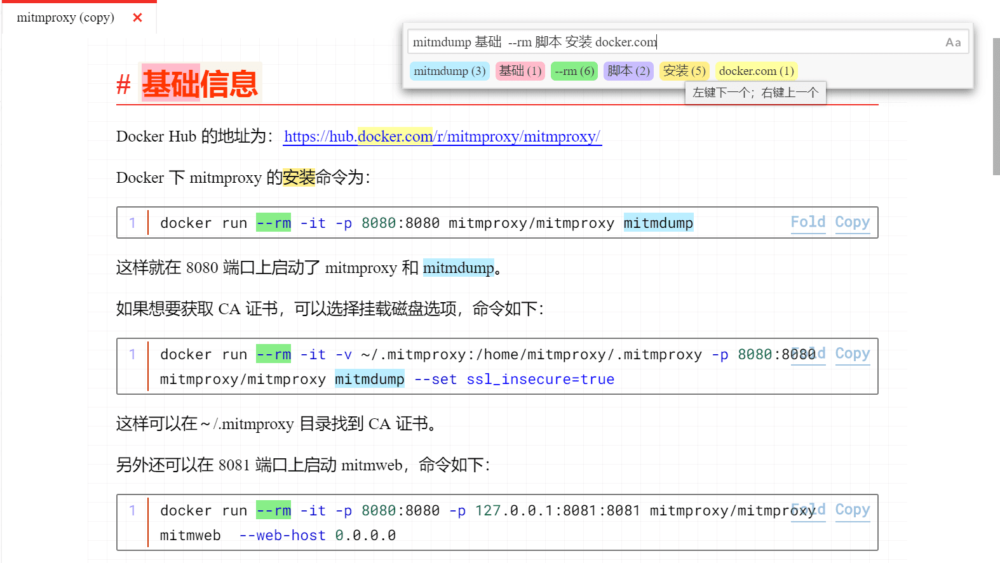

> 注意：当你鼠标点击文档内容时，会自动退出高亮状态。**这是 Typora 本身的限制导致的**。你可以试试 Typora 自身的 ctrl+F 搜索，在搜索关键字后，点击任意地方原先高亮的地方也会消失。


### collapse_paragraph：章节折叠

折叠 / 展开 章节下所有文本。

支持折叠的标签：h1~h6。

- `ctrl+click`：折叠 / 展开【单个章节】
- `ctrl+alt+click`：折叠 / 展开【父章节下所有同级的章节】
- `ctrl+shift+alt+click`：折叠 / 展开【所有同级的章节】


### md_padding：中英文混排优化

中英文混排时，中文与英文之间、中文与数字之间添加空格。

快捷键：ctrl+shift+B


> 插件本来快捷键是 ctrl+shift+K，但是已经被新版本 Typora 占用了，目前此插件的快捷键已经改成 ctrl+shift+B，上面的动图懒得改了。


### templater：文件模板功能

类似于 obsidian 的文件模板功能，根据模板快速创建文件。

使用方式：右键菜单 -> 常用插件 -> 自定义插件 -> 文件模板。

支持的模板变量：

- `{{date}}`： 当前日期
- `{{time}}`：当前时间
- `{{weekday}}`：当前周几
- `{{datetime}}`：当前日期时间
- `{{yesterday}}`：昨天日期
- `{{tomorrow}}`：明天日期
- `{{random}}`：随机数
- `{{title}}`：新建文件的标题
- `{{folder}}`：当前文件的目录
- `{{filepath}}`：新建文件的路径
- `{{range}}`：当前选取的文字
- `{{uuid}}`：uuid

> 模板列表请前往配置文件修改。


### resourceOperation：一键清除无用图片，生成报告

使用方式：右键菜单 -> 常用插件 -> 自定义插件 -> 资源管理

> NOTE：由于删除文件是危险操作，默认只会生成报告，不会删除。如果需要删除文件，请手动修改配置文件的 `operation` 选项

```toml
# report: 生成报告
# delete: 直接删除
# move  : 移动到当前文件夹
operation = "report"
```


### fence_enhance：一键复制代码，折叠代码


### commander：命令行环境

> 有些插件依赖于此插件，不建议禁用。

功能和 total commander 的命令行一样（快捷键也一样），一个快速执行命令的工具，并提供少量交互。

- `ctrl+G`：弹出执行框
- `esc`：隐藏执行框
- `ctrl+拖动输入框`：移动位置

支持 shell：

- `cmd/bash`：windows 或 Mac 的默认终端
- `powershell`：微软的傻儿子 :D
- `git bash`：使用此终端前请保证安装了 git bash 并且加入环境变量
- `wsl`：使用此终端前请保证安装了 wsl2，并且加入环境变量

内置环境变量：

- `$f`：当前文件路径
- `$d`：当前文件的所属目录
- `$m`：当前挂载的根目录

支持内建命令，方便快速调用。个人可按需自定义配置文件里的 `BUILTIN` 选项。

```toml
# 默认的内建命令
[[commander.BUILTIN]] # dummy
name = ""
shell = "cmd/bash"
cmd = ""
[[commander.BUILTIN]]
name = "Explorer"
shell = "powershell"
hotkey = "ctrl+alt+e"
cmd = "explorer $d"
[[commander.BUILTIN]]
name = "Vscode"
shell = "cmd/bash"
cmd = "code $f"
[[commander.BUILTIN]]
name = "WT"
shell = "cmd/bash"
cmd = "cd $d && wt"
[[commander.BUILTIN]]
name = "GitCommit"
shell = "cmd/bash"
cmd = "cd $m && git add . && git commit -m \"message\""
```


### mindmap：  根据文档大纲一键生成思维导图

使用方式：右键菜单 -> 常用插件 ->  思维导图

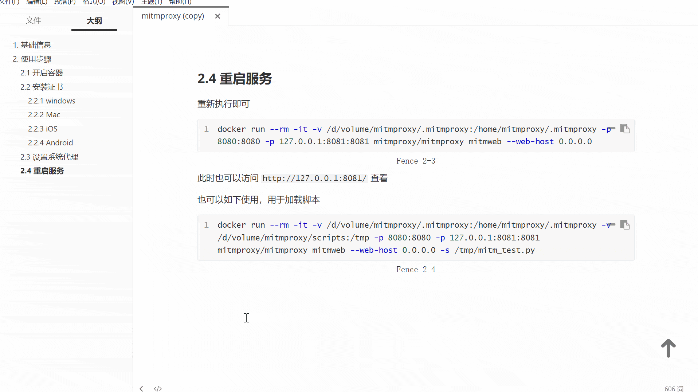


### markmap：提供 markmap 支持

使用方式：

- 方式一：右键菜单 -> 非常用插件 -> markmap
- 方式二：直接点击右下角的 markmap 按钮

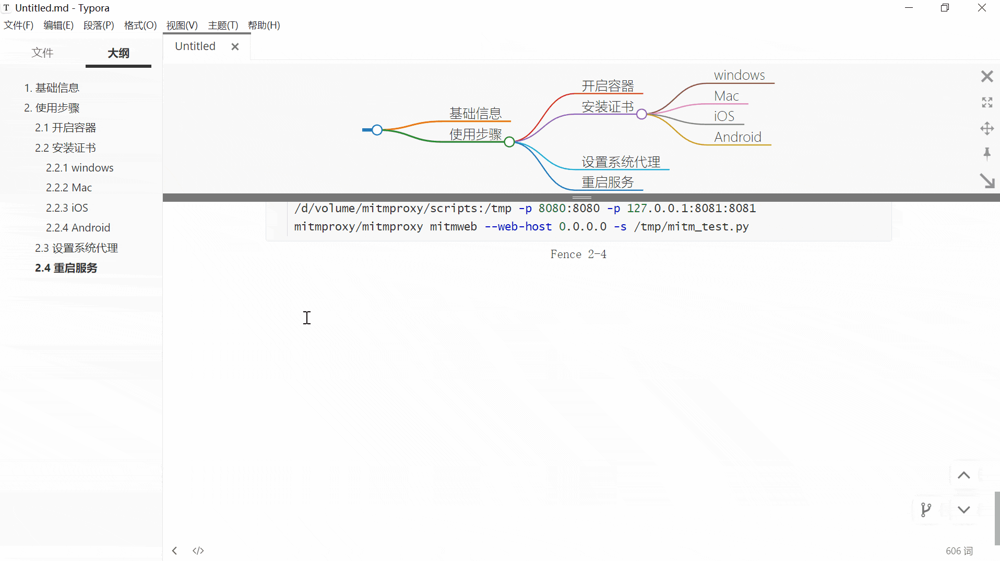


### toolbar：多功能搜索栏

> 类似于 vscode 的 ctrl+shift+p 功能

使用方式：

- 方式一：右键菜单 -> 非常用插件 -> 多功能搜索栏
- 方式二：快捷键 `ctrl+j`

支持搜索：

- `his`：最新打开过的文件
- `plu`：插件
- `tab`：打开的标签页
- `ops`：常用操作
- `out`：文档大纲
- `mode`：切换文件模式
- `theme`：临时切换主题
- `func`：功能列表
- `all`：混合查找（所有项目都混在一起查找）

键入内容说明：

- 键入内容 = 搜索工具名称 + 空格 + 搜索内容
- 支持 `交集查询`、`差集查询`，并且可以随意组合（类似于 google 的正负向查询）

举例：

- `his node learn`：查找最近打开的文件，要求文件标题【包含 node 和 learn 两个关键字】
- `plu multi -search`：查找插件，要求插件名【包含 multi 关键字，但是不包含 search 关键字】
- `tab -messing`：查找所有打开的标签页，要求标签页名称【不包含 messing 关键字】
- `his close -win -mark 标签`：查找最近打开的文件，要求文件标题【包含 close、标签，不包含 win、mark】

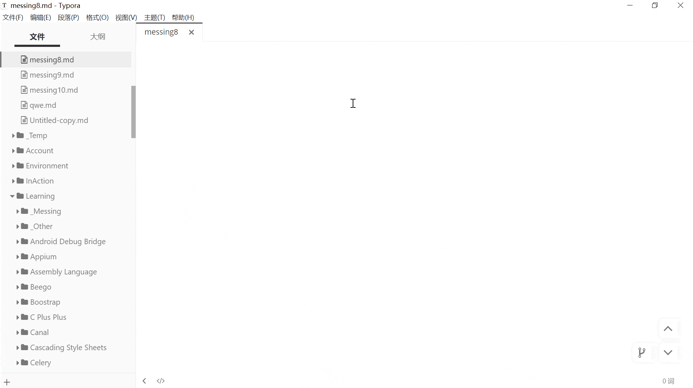


### right_click_menu：右键菜单统一管理插件

所有插件都支持在右键菜单中直接调用。鼠标党可以将右键菜单作为所有插件的主要调用方式。

可以通过修改配置文件自定义右键菜单：

```toml
#  每一个MENUS对应一个一级菜单，允许无限添加一级菜单，允许重复添加同一个插件
#  NAME: 一级菜单的名称
#  LIST: 二级菜单的插件列表（使用"---"代表在页面上插入一个divider，以作分隔）
[[right_click_menu.MENUS]]
NAME = "非常用插件"
LIST = [
    "window_tab",
    "resize_image",
    "resize_table",
    "fence_enhance",
    "export_enhance",
    "datatables",
    "markmap",
    "auto_number",
    "truncate_text",
    "right_click_menu",
    "---",
    "blur",
    "go_top",
    "text_stylize",
    "toolbar",
    "---",
    "file_counter",
    "mermaid_replace",
    "test",
]
[[right_click_menu.MENUS]]
NAME = "常用插件"
LIST = [
    "commander",
    "mindmap",
    "collapse_paragraph",
    "custom",
    "---",
    "search_multi",
    "multi_highlighter",
    "outline",
    "md_padding",
    "read_only",
]
```


### echarts：提供 echarts 支持

使用方式：右键菜单 -> 常用插件 -> 自定义插件 -> 插入 echarts

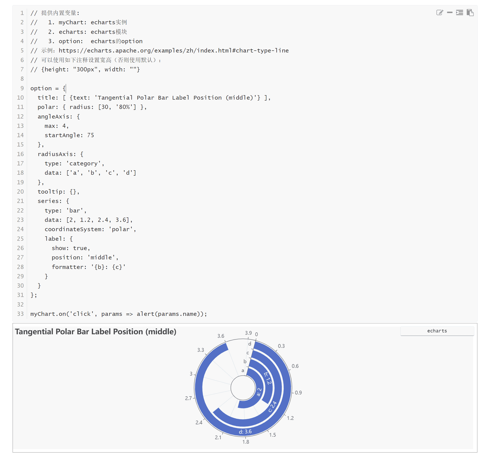

> 使用 eval() 解析代码块内容，请注意安全问题。


### chart：提供 chartjs 支持

使用方式：右键菜单 -> 常用插件 -> 自定义插件 -> 插入 chart

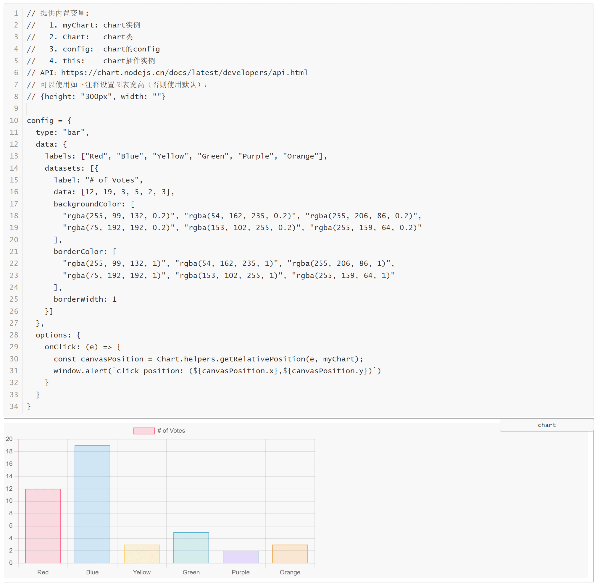


### abc：提供 abc 组件支持


### calendar：  提供 tui.calendar 组件支持

使用方式：右键菜单 -> 常用插件 -> 自定义插件 -> 插入 calendar

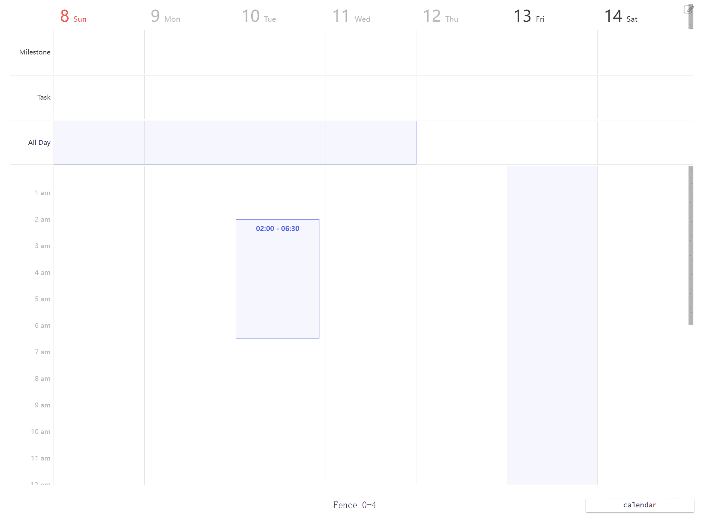


### callouts：  提供 callouts 支持

使用方式：右键菜单 -> 常用插件 -> 自定义插件 -> 插入 callouts


数量、类型、颜色、icon 皆可自己定义，请前往配置文件修改：

```toml
[[callouts.config.list]]
type = "note"
background_color = "#e1d1eb"
left_line_color = "#6a1b9a"
icon = "\\f040"
```


### text_stylize：文字风格化

将文字转为 html 格式，改变文字样式。

使用方式：右键菜单 -> 非常用插件 -> 文字风格化。

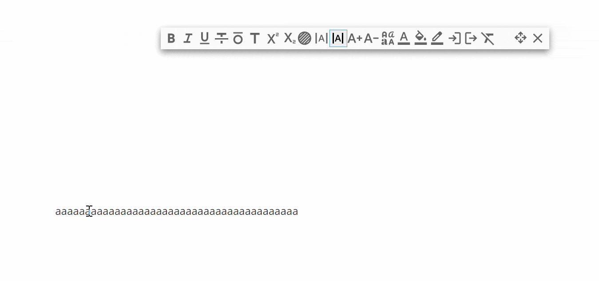


### read_only：只读模式

只读模式下文档不可编辑。

快捷键：ctrl+shift+R

> 开启后，右下角数字统计区域会出现 `ReadOnly` 字样


### blur：模糊模式

开启后，只有当前聚焦的组件可见，其余模糊。可以用于防偷窥。

使用方式：右键菜单 -> 非常用插件 -> 模糊模式

> 此插件只能高版本 Typora 使用，暂时没有兼容低版本。


### kanban：看板

拓展代码语法，添加看板功能。

语法：

- 一级标题表示看板标题
- 二级标题表示看板
- `-` 或 `*` 表示任务
- 任务后面的 `()` 表示任务描述


### timeline：时间线

拓展代码语法，添加时间线功能。

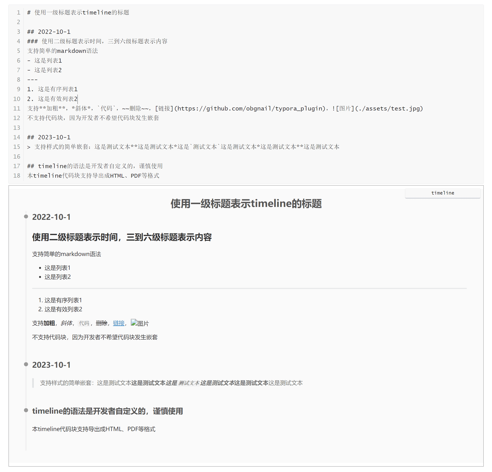


### file_counter：显示文件数

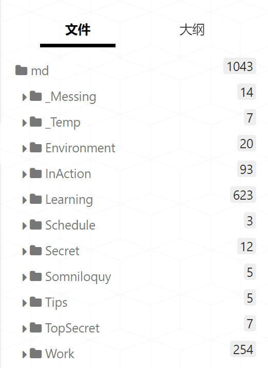


### outline：以表格、图片、代码块形式的大纲

使用方式：右键菜单 -> 常用插件 ->  类别大纲


### auto_number：自动编号


支持编号的组件（皆可临时或永久打开/关闭）：

1. 标题
2. 大纲
3. TOC
4. 表格
5. 图片
6. 代码块

> 注意：通过注入 CSS 实现此功能，有可能会与你使用的 theme 冲突。

> 和其他使用 Theme CSS 的实现方式不同，此插件通过修改内置函数，完美解决导出 PDF 后侧边栏没有编号的问题 :)

> 根据 [Markdown 最佳实践](https://learn.microsoft.com/en-us/powershell/scripting/community/contributing/general-markdown?view=powershell-7.3)，一篇文档应该 **有且仅有** 一个 h1，故此插件从 h2 开始编号。


### imageReviewer：图片查看器

一站式图片查看，并且提供简单图片编辑。

使用方式：

- 方式一：点击右下角【查看图片】按钮
- 方式二：右键菜单 -> 常用插件 ->  自定义插件 -> 图片查看器

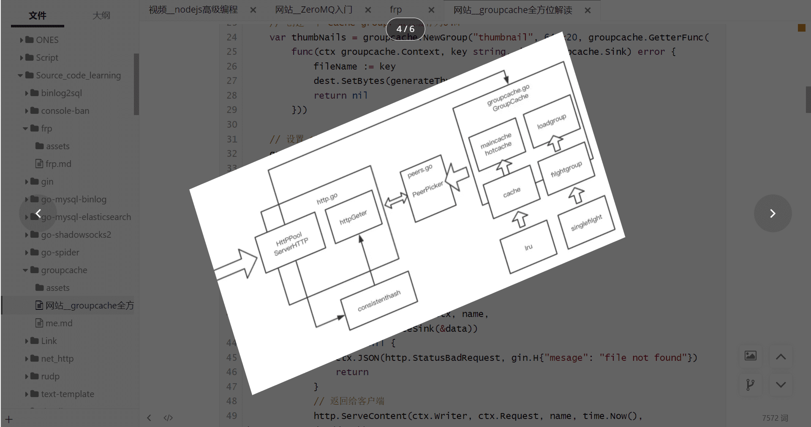


### chineseSymbolAutoPairer：中文符号自动补全

输入 `《 【 （ ‘ “ 「` 符号时自动补全。

自动补全的符号支持自定义：

```toml
# 需要自动补全的符号（第一项为输入符号，第二项为补全符号）
auto_pair_symbols = [
    ["（", "）"],
    ["《", "》"],
    ["‘", "’"],
    ["“", "”"],
    ["【", "】"],
    ["「", "」"],
]
```


### datatables：表格增强

增强表格。提供搜索、过滤、分页、排序等功能。

> 使用方式：将光标定位在表格 -> 右键菜单 -> 非常用插件 ->  表格增强。


其实此插件可以是提供开放能力的，实现类似于 obsidian 的 `dataview` 插件的功能。不过暂时不做，原因：

1. 私以为 Typora 的用户并不需要大量用到此功能。
2. 需要用户熟悉 javascript 以及 dataTables.js 的 API。成本太高。
3. 需要编写大量的配套代码。


### resize_table：拖动调整表格大小

`ctrl+鼠标拖动`：修改表格的行高列宽。


### resize_image：调整图片大小

`ctrl+鼠标滚轮滚动`：调整图片大小。


### export_enhance：导出增强

导出 html 时，将图片转为 base64，避免图片丢失。

> 此插件有个配置为 `DOWNLOAD_NETWORK_IMAGE`，功能是下载网络图片并转为 base64，默认为 false。若置为 true，有可能因为网络问题导致导出超时。


### go_top： 一键到顶

在右下角添加一个一键到顶的按钮。


### reopenClosedFiles：打开上次退出 Typora 时尚未关闭的标签页

自动 或者 通过快捷键打开上一次退出 Typora 时尚未关闭的标签页

> 此插件仅在 window_tab 启用时生效


### truncate_text：暂时隐藏内容，提高大文件渲染性能

大文件在 Typora 的渲染性能很糟糕，用此插件暂时隐藏内容（只是隐藏显示，不修改文件），提高渲染性能。也可以用于防偷窥。

使用方式：右键菜单 -> 非常用插件 -> 文本截断。

包含的功能如下：

- 隐藏最前面：隐藏最前面的文本段，只留下最后 80 段。
- 重新显示：重新显示之前隐藏的所有文本段。
- 根据当前可视范围显示：根据当前可视范围显示文本段。

> 原理：通过设置 DOM 元素的 display 样式为 none 来隐藏元素，让元素不占用渲染树中的位置，对隐藏的元素操作不会引发其他元素的重排。

> collapse_paragraph （章节折叠功能）可以很好的替代此插件，建议使用 collapse_paragraph。


### markdownLint：markdown 格式规范检测

使用方式：

- 方式一：右键菜单 -> 常用插件 -> 自定义插件 -> md 格式规范检测
- 方式二：点击右上角的小方块


### darkMode：夜间模式

使用方式：右键菜单 -> 常用插件 -> 自定义插件 -> 夜间模式


### pluginUpdater：一键升级插件

使用方式：右键菜单 -> 常用插件 -> 自定义插件 ->  升级插件。

> 众所周知，有些用户并不能裸连 github 下载最新插件，故提供了设置代理功能（默认为系统代理）


### extractRangeToNewFile：提取选区文字到新文件

使用方式：选中一些文字 -> 右键菜单 -> 常用插件 -> 自定义插件 ->  提取选区文字到新文件。


### fullPathCopy：复制标题路径

使用方式：将光标定位到标题上 -> 右键菜单 -> 常用插件 -> 自定义插件 ->  复制标题路径。

就会生成如下文字，并复制到剪切板：

```
README.md\Typora Plugin 一级标题\插件使用说明 二级标题\fullPathCopy：复制标题路径 三级标题
```


### autoTrailingWhiteSpace：为文档添加结尾空格

使用方式：将光标定位到标题上 -> 右键菜单 -> 常用插件 -> 自定义插件 ->  为文档添加结尾空格。

> 根据严格的 Markdown 换行语法，需要在结尾添加两个空格以表示换行。此工具能一键添加空格。

> 此插件默认关闭，需手动开启。


### redirectLocalRootUrl：重定向本地资源根目录

如果你主要使用 obsidian 或 joplin 来管理文件，偶尔用 typora 打开文件。就会遇到一个问题：obsidian 或 joplin 都是将本地资源放在同一个目录中（vault），这导致在 typora 打开后文件由于路径错误，无法访问本地资源。此插件就是为了解决此问题，重定向本地资源根目录。

> 此插件默认关闭，需手动开启。

使用此插件前需要设置如下配置选项：

```toml
# 资源根目录，支持绝对路径(如D:\\tmp\\img)和相对路径(如.\\assets)，填写时请注意转义反斜线（若为空，则此插件失效）
root = "./"
# 过滤的正则表达式：只有文件路径命中filter_regexp匹配的文件才使用此插件（若为空，则全部文件都使用此插件）
filter_regexp = ""
```


### openInTotalCommander：在 total commander 打开当前文件

使用方式：将光标定位到标题上 -> 右键菜单 -> 常用插件 -> 自定义插件 ->  TC 打开。

> 使用此插件前，需要您在配置手动修改 TC 的安装路径。

> 此插件默认关闭，需手动开启。


### scrollBookmarker： 书签管理器

使用方式：

1. 使用 alt+click 正文内容，打上书签。
2. 接着调出书签管理器，点击上面的书签，即可跳转到书签。

调出书签管理器：

- 方式一：右键菜单 -> 常用插件 -> 自定义插件 -> 书签管理器
- 方式二：点击右下角的【书签管理器】按钮


### bingSpeech：必应朗读

使用方式：鼠标框选一小段文字 -> 右键菜单 -> 常用插件 -> 自定义插件 -> 必应朗读

实现原理：采用爬虫技术，盗取必应翻译的播放语音功能

> 注意：功能完全依赖于外部环境，因此不能保证成功。开发者一时兴起做的，仅作娱乐使用。


### help：  用户帮助

使用方式：右键菜单 -> 非常用插件 -> 帮助。


### mermaid_replace：替换 mermaid

如果你不愿意更新 Typora 版本，同时又想使用新版本的 mermaid，或者想自定义 mermaid 样式，可以使用此插件。

> 此插件默认关闭，需手动开启。


### hotkeyHub：快捷键注册中心（高级）

> 此插件是高级插件，仅对有 javascript 基础的用户开放。

功能：以声明的形式，为【任意插件系统函数】或【任意自定义函数】绑定快捷键。

具体使用请参考 [hotkey.default.toml](https://github.com/obgnail/typora_plugin/blob/master/plugin/global/settings/hotkey.default.toml)。


### quickButton：于右下角添加功能按钮（高级）

> 此插件是高级插件，仅对有 javascript 基础的用户开放。

功能和 hotkeyHub 类似，以声明的形式，为【任意插件系统函数】设置快捷按钮。


### custom：开放平台，用户自定义插件（高级）

> 此插件是高级插件，仅对有 javascript 基础的用户开放。

功能：提供开放能力，支持用户自己写插件。

具体使用请参考 [请读我.md](https://github.com/obgnail/typora_plugin/blob/master/plugin/custom/%E8%AF%B7%E8%AF%BB%E6%88%91.md)。


### json_rpc：外部操纵 Typora（高级）

功能：将包括 typora-plugin 所有功能在内的一切能力通过 `json-rpc` 的形式暴露出去，以供外部操纵 Typora。

具体使用请参考 [请读我.md](https://github.com/obgnail/typora_plugin/blob/master/plugin/json_rpc/%E8%AF%B7%E8%AF%BB%E6%88%91.md)。

> 此插件是高级插件，默认关闭，需手动开启，且仅对开发人员开放。
>
> 开启此插件后，外部将拥有 node、browser 两套环境，能完全控制电脑，因此如果您不是开发人员，请勿开启此插件。


## 小众软件推荐

[通过注入 js 代码，为 Typora 额外增加 4 个功能](https://www.appinn.com/typora-4-plugin/)

> 第一次上榜小众软件，心情非常冲动。同时祝小众软件越办越好。


## 致谢

- MIT：[markmap](https://markmap.js.org/) | [chartjs ](https://www.chartjs.org/)| [abcjs](https://github.com/paulrosen/abcjs) | [tui.calendar ](https://github.com/nhn/tui.calendar)| [DataTables](https://github.com/DataTables/DataTables) | [markdownlint](https://github.com/DavidAnson/markdownlint)
- Apache：[echarts](https://echarts.apache.org/zh/index.html)
- without-licence：[typora-tabbar-plugin](https://github.com/gatziourasd/typora-tabbar-plugin) | [md-padding](https://github.com/harttle/md-padding)


## 结语

本人并非前端开发，前端技术全靠 Google，JS/CSS 写的很烂。

**本项目遵循 MIT 协议，请自由地享受。**

如果对各位有用的话，欢迎 star ⭐，欢迎推荐给你志同道合的朋友使用。

