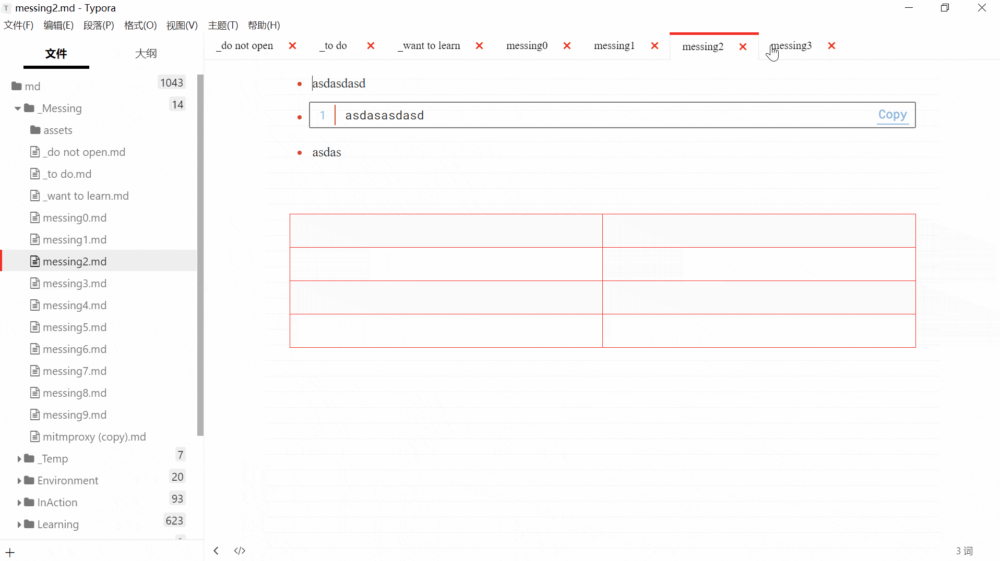
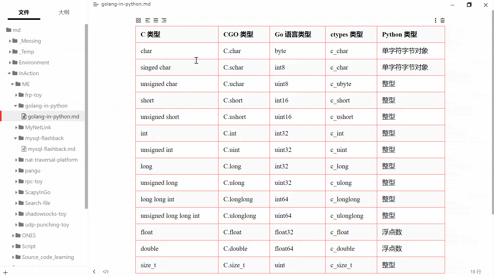
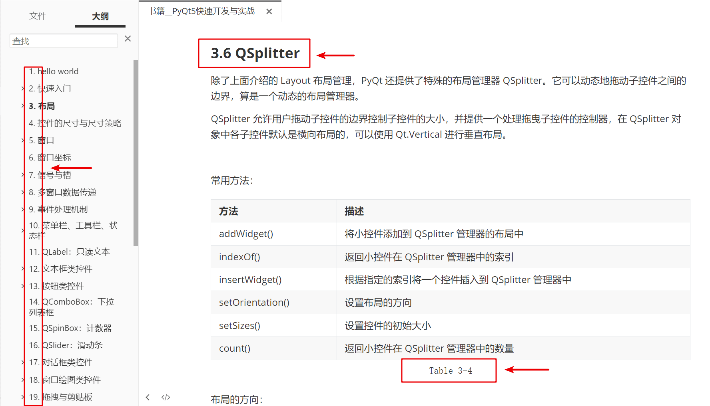

# Typora Plugin

<div align="center">
  
</div>

目前支持的功能：

| 序号 | 文件名             | 功能                             | 默认开启 |
| ---- | ------------------ | -------------------------------- | -------- |
| 1    | window_tab         | 标签页管理                       | √        |
| 2    | search_multi       | 全局多关键字搜索                 | √        |
| 3    | multi_highlighter  | 多关键字高亮                     | ×        |
| 4    | collapse_paragraph | 章节折叠                         | √        |
| 5    | md_padding         | 中英文混排优化                   | √        |
| 6    | fence_enhance      | 一键复制代码，折叠代码           | √        |
| 7    | commander          | 命令行环境                       | √        |
| 8    | read_only          | 只读模式                         | √        |
| 9    | file_counter       | 显示目录下的文件数               | √        |
| 10   | resize_table       | 调整表格行高列宽                 | √        |
| 11   | resize_image       | 调整图片显示大小                 | √        |
| 12   | auto_number        | 章节、大纲、表格、图片自动编号   | √        |
| 13   | go_top             | 一键到文章顶部                   | √        |
| 14   | truncate_text      | 暂时隐藏内容，提高大文件渲染性能 | √        |
| 15   | right_click_menu   | 右键菜单统一管理、调用插件       | √        |
| 16   | mermaid_replace    | 替换 mermaid 组件                | ×        |
| 17   | old_window_tab     | 标签页管理（已废弃）             | ×        |

1. 每个功能都对应源码的 plugin 文件夹下的一个同名文件（index.js 除外），**如若不需要某些功能，按需删除文件即可**。
2. 每个功能都有对应的配置，且每个配置选项都有注释说明。可以按需修改对应 JS 文件里的 config。

> 如果各位有其他的需求，欢迎提 issue。


## 如何使用

1. 下载插件源码。
2. 进入 Typora 安装路径，找到包含 `window.html` 的文件夹 A。（一般是 `Typora/resources/app/window.html` 或者 `Typora/resources/window.html`，推荐使用 everything 找一下）
3. 打开文件夹 A，将源码的 plugin 文件夹粘贴进该文件夹下。
4. 打开文件 `A/window.html`。搜索文件内容 `<script src="./app/window/frame.js" defer="defer"></script>` 或者 `<script src="./appsrc/window/frame.js" defer="defer"></script>`，并在 **后面** 加入 `<script src="./plugin/index.js" defer="defer"></script>`。保存。
5. 重启 Typora。
6. 验证：点击鼠标右键，弹出右键菜单栏，如果能看到【启动插件】栏目，说明一切顺利。


### 新版本操作

> 根据文件夹 A 下是否有 `appsrc` 目录判断是否为新版本，有则新版本，无则旧版本。


### 旧版本操作


> 虽然操作简单，还请务必对照上图谨慎操作。如果修改完 Typora 白屏了，很可能是你修改的时候疏忽了。


## 实现原理

### 前端

`window.html` 是 Typora 的初始文件，可以写入一个 `<script>` 标签实现功能。就和 Tampermonkey 脚本一样。


### 后端

1. 因为 Typora 暴露了 `reqnode` 函数（require 的封装），所以可以使用 `reqnode('path')` 导入 Node.js 的 path 库，其他内置库同理。
2. 因为 Typora 使用了不太安全的 `executeJavaScript` 功能，所以可以用此注入 JS 代码，从而劫持后端关键对象，进而实现 electron 的后端功能注入。理论上劫持了 electron 对象，你甚至可以在 Typora 里斗地主。

```javascript
// 控制台输入下面命令:

// 恭喜你成功让第二个窗口打印消息
JSBridge.invoke("executeJavaScript", 2, `console.log("i am logging")`);

// 恭喜你成功让所有窗口打印消息
ClientCommand.execForAll(`console.log("i am logging")`);

// 恭喜你成功获取到本窗口的BrowserWindow对象
global.reqnode('electron').remote.require('electron').BrowserWindow;

// 恭喜你成功获取到所有窗口的BrowserWindow对象
ClientCommand.execForAll(`console.log(global.reqnode('electron').remote.require('electron').BrowserWindow)`);

// 恭喜你成功让窗口1执行语句_myValue=123，然后将变量_myValue传给窗口2
JSBridge.invoke('executeJavaScript', 1, "_myValue=123; JSBridge.invoke('executeJavaScript', 2, `console.log(${_myValue})`)");
```


## 插件/脚本

### window_tab：标签页管理

- `鼠标置于标签页处，ctrl+鼠标滚轮`、`ctrl+shift+tab`、`ctrl+tab`：切换标签
- `ctrl+w`：关闭标签
- `ctrl+click 标签页`、`向下拖拽标签`：新窗口打开
- 拖拽：排序标签



> 该脚本是 [typora-tabbar-plugin](https://github.com/gatziourasd/typora-tabbar-plugin) 的重新实现，修复了原脚本的诸多 BUG 和不适配问题；去掉了类似于 vscode 的预览功能，改成了 idea 的标签页逻辑；修改了一些交互。


### search_multi：全局多关键字搜索

比如搜索同时包含 `golang` 和 `install` 和 `生命周期` 三个关键字的文件。

- `ctrl+shift+P`：打开搜索框
- `esc`：关闭搜索框
- `enter`：搜索
- `ArrowUp`，`ArrowDown`：方向键上下选中
- `click`、`ctrl+enter`：当前窗口打开
- `ctrl+click`、`ctrl+shift+enter`：新窗口打开
- `ctrl+拖动输入框`：移动位置

> ctrl 在 Mac 中对应 command


### multi_highlighter：多关键字高亮（暂时禁用）

搜索并高亮关键字，并提供一键定位功能（左键下一个，右键上一个）

- `ctrl+shift+H`：打开搜索框
- `esc`：关闭搜索框
- `enter`：搜索
- `ctrl+拖动输入框`：移动位置
- `左键色块`：定位到下一个关键字
- `右键色块`：定位到上一个关键字


> 注意：当你鼠标点击文档内容时，会自动退出高亮状态。**这是 Typora 本身的限制导致的**：高亮功能是通过添加标签实现的，但是为了保证数据安全，`#write` 标签不允许手动添加任何标签，所以需要在编辑的时候 remove 掉之前添加的标签。（你可以试试 Typora 自身的 ctrl+F 搜索，在搜索关键字后，点击任意地方原先高亮的地方也会消失）

> 已知BUG：**Typora 对于大文件会惰性加载代码块，导致代码块里面添加的标签会被刷新掉。暂时默认关闭此脚本，待解决后重新开启。**


### collapse_paragraph：章节折叠

折叠 / 展开 章节下所有文本。

支持折叠的标签：h1~h6。

- `ctrl+click`：折叠 / 展开【单个章节】
- `ctrl+alt+click`：折叠 / 展开【父章节下所有同级的章节】
- `ctrl+shift+alt+click`：折叠 / 展开【全局所有同级的章节】


### md_padding：中英文混排优化

中英文混排时，中文与英文之间、中文与数字之间添加空格。

快捷键：Ctrl+shift+K


> NOTE：**此脚本会直接修改文件**。虽然支持 Ctrl+Z 还原，还是建议提前备份。


### fence_enhance：一键复制代码，折叠代码


> Fold、Copy 可选，如不需要，可以关闭任意一个。

> fence_enhance.js 易于扩展，你可以根据自己的需要添加功能，比如显示代码块编程语言。


### commander：命令行环境

> 如果你看不懂下面描述，那么你就不需要此脚本。

功能和 total commander 的命令行一样（快捷键也一样），一个快速执行命令的工具，并提供少量交互。

- `ctrl+G`：弹出执行框
- `esc`：隐藏执行框
- `ctrl+拖动输入框`：移动位置

支持 shell：

- `cmd/bash`：windows 或 Mac 的默认终端
- `powershell`：微软的傻儿子 :D
- `git bash`：使用此终端前请保证安装了 git bash 并且加入环境变量
- `wsl`：使用此终端前请保证安装了 wsl2，并且加入环境变量

内置环境变量：

- `$f`：当前文件路径
- `$d`：当前文件的所属目录
- `$m`：当前挂载的根目录

支持内建命令，方便快速调用。个人可按需自定义脚本里的 `BUILTIN` 变量。

```js
// 默认的内建命令
const BUILTIN = [
    {name: "", shell: SHELL.CMD_BASH, cmd: ""}, // dummy
    {name: "Explorer", shell: SHELL.POWER_SHELL, cmd: "explorer $d"},
    {name: "Vscode", shell: SHELL.CMD_BASH, cmd: "code $f"},
    {name: "WT", shell: SHELL.CMD_BASH, cmd: "cd $d && wt"},
    {name: "GitCommit", shell: SHELL.CMD_BASH, cmd: `cd $m && git add . && git commit -m "message"`},
];
```


### resize_table：拖动调整表格大小

`ctrl+鼠标拖动`：修改表格的行高列宽。




### resize_image：调整图片大小

`ctrl+鼠标滚轮滚动`：调整图片大小。


### file_counter：显示文件数


### auto_number：自动编号



支持编号（皆可单独打开/关闭）：

- 章节
- 大纲
- TOC
- 表格
- 图片

> 注意：通过注入 CSS 实现功能，有可能会与你使用的 theme 冲突。


### right_click_menu：右键菜单统一管理插件


> 当快捷键冲突时，可以使用此插件通过鼠标点击调用插件。


### read_only：只读模式

只读模式下文档不可编辑。

快捷键：ctrl+shift+R。


### truncate_text：暂时隐藏内容，提高大文件渲染性能

大文件在 Typora 的渲染性能很糟糕，用此脚本暂时隐藏内容（只是隐藏显示，不修改文件），提高渲染性能。

- `ctrl+shift+B`：隐藏最前面的文本段，只留下最后 80 段
- `ctrl+shift+U`：重新显示所有文本段
- `ctrl+shift+Y`：根据当前可视范围显示文本段

> 原理：通过设置 DOM 元素的 display 样式为 none 来隐藏元素，让元素不占用渲染树中的位置，对隐藏的元素操作不会引发其他元素的重排。


### go_top： 一键到顶

在右下角添加一个一键到顶的按钮。


### mermaid_replace：替换 mermaid

如果你像我一样，不愿意更新 Typora 版本，同时又想使用新版本的 mermaid，或者想自定义 mermaid 样式，可以使用此脚本。

> NOTE：**此脚本默认关闭，需手动开启。**


## 瞎聊

### 脚本会失效吗?

Typora 是闭源软件，要是有一天作者改了代码，是不是就不能用了？从原理来说，是的。实际上我是解包 Typora，看了部分源码才实现了这些功能。

同时值得注意的是， Typora 的历史包袱还蛮重的。比如说 github 已经有无数个 Typora theme，这决定了它的页面它不可能大改，就算改变也大概率是向下兼容的。

具体来看：

- search_multi、resize_table、read_only、truncate_text 等功能几乎不依赖 Typora 实现。如果这些功能失效了，那么 github 上的 Typora theme 会大面积失效，所以应该会 **保持长时间的有效性**。而且就算失效了也容易找到兼容方案。
- ~~比较特殊的是 window_tab 和 window_tab_drag，这个功能本质是入侵式脚本；通过原型链攻击，将后端 electron 对象劫持到前端来，该脚本通过该手段成功调用了 Typora 的核心实现，并且这个核心实现同时被大量运用，历史包袱一样很大。当然了，劫持漏洞也有可能被修复。**如果 Typora 或 electron 有了重构级别的更新，那么大概率会失效。**~~（旧版本已被废弃，新版本无此问题）


### 为什么要区分 old_window_tab 和 old_window_tab_drag ?

理由是：**支持排序会复杂很多**。

Typora 每开一个窗口，就会创建一个 electron BrowserWindow 实例，而且每个实例都有自己的 web 页面和渲染进程。标签管理本来是应该在 electron 后端实现的，现在强行要在前端实现，只能使用劫持后端关键对象，然后在每个窗口绘制这种非常绿皮的方式实现。

排序意味着状态的引入 —— 当创建第五个窗口的时候，新建的窗口必须要知道前面四个窗口的顺序：

- 如果此功能在后端实现的话就很好办，搞一个全局对象保存现有的窗口列表，创建窗口的时候传给他。
- 如果在前端实现的话就很痛苦，如上所述，每个窗口都有自己的 web 页面和渲染进程，你无法跨进程获取变量。

最可行的方案是使用 localStorage 存储当前的窗口列表。但是我希望脚本是无状态的，每次打开都是一次全新开始 —— 如果 Typora 崩溃，处在 localStroge 里的脏数据就会影响下次启动。

我采取的方法是应答。第五个窗口创建的时候就会通过 IPC 去询问第四个窗口当前的窗口列表，等第四个窗口回复之后，第五个窗口进行数据处理，再将新的窗口列表通知给所有的窗口，让它们重新渲染。

**这种方式就是带着脚铐跳舞，是奇技淫巧，绿皮中的绿皮**。


### window_tab 和 old_window_tab 区别 ?

- old_window_tab 是通过劫持 electron，获取到后端的 BrowserWindow 实例实现的，是真正意义的标签管理。但是此方法已在高版本的 Typora 失效。所以 old_window_tab 已被废弃。
- window_tab 是 **强行将多窗口合并到单一窗口实现的**。实现原理是：记录每一个标签对应的文档路径和文档浏的 scrollTop。每当你点击一个标签，其实是重新打开文件，然后在定位到离开文档时的 scrollTop。其后果就是：
  1. 不能存储每个打开的文档（虽然有缓存）。
  2. 与 Typora 诸多冲突，为了解决这些冲突，需要给 frame.js 的很多函数注入修改逻辑。降低了系统稳定性。


## 小众软件推荐

[通过注入 js 代码，为 Typora 额外增加 4 个功能](https://www.appinn.com/typora-4-plugin/)

> 第一次上榜小众软件，心情非常冲动。同时祝小众软件越办越好。


## 结语

本人并非前端开发，前端技术全靠 Google，JS/CSS 写的很烂。

感谢 new bing 对于本项目的大力支持。感谢 [md-padding](https://github.com/harttle/md-padding) 提供的 space padding 功能。感谢 [typora-tabbar-plugin](https://github.com/gatziourasd/typora-tabbar-plugin) 提供思路 :) 

如果对各位有用的话，欢迎 star ⭐

